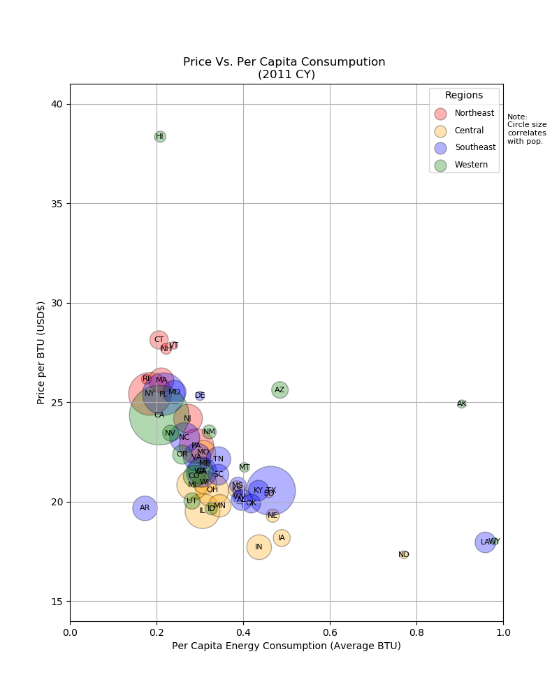

# Energy_Census
US energy census information for 2011-2014.

Data exploration between various types of information collected by US government.
  1. Census and Geographic Data
  2. Energy Data
  3. Economic Data

Source: Bureau of Economic Analysis, US Department of Commerce.

Example:

